Pages will undergo processing by examining search parameters, subdomains, and custom URLs. Subsequently, API calls will be made to retrieve the specified data based on these criteria.

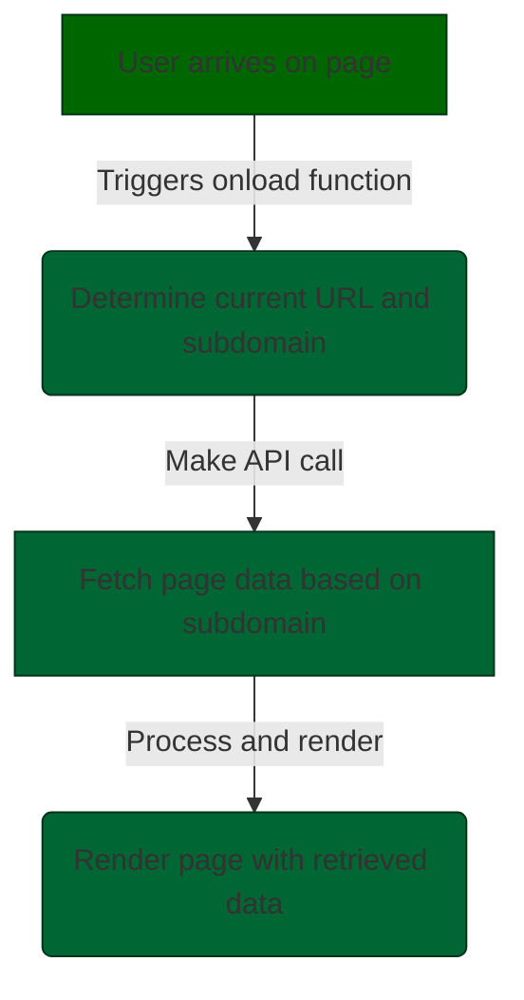


 Upon a user's page arrival, an `onload` function is activated. This function examines the current URL for a subdomain, searching for page data linked to the organization's username. The objective is to enhance page content uniqueness, prioritizing data over design improvements.

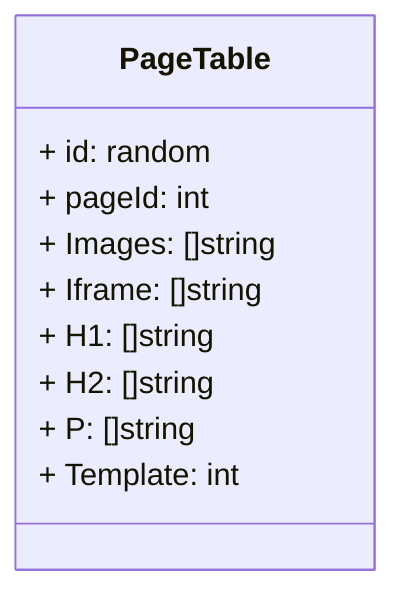


This management approach enables efficient and diverse saving of website data. Individual pages will be rendered conditionally based on the specified route, allowing for flexibility in presenting content as per the given conditions.

and is advantageous due to the fact that fetching an array of images for example can render all images in a list of all present on the page


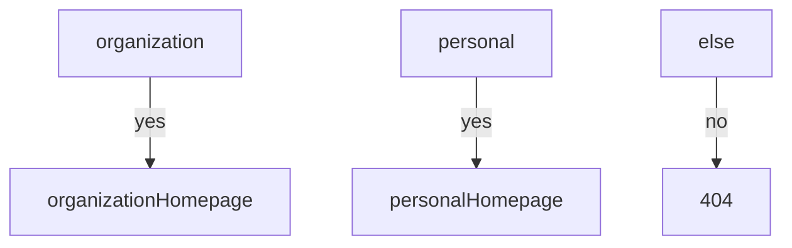


use cases 

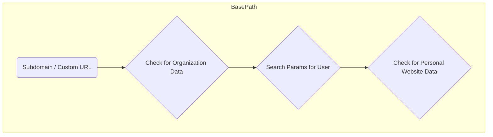


**Home
# Organization 
- [x] backdrop photo
- [x] services overview
- [ ] donation 
- [ ] videos
- [ ] mission & objective
- [ ] mailing list
- [ ] 

Authentication Middleware


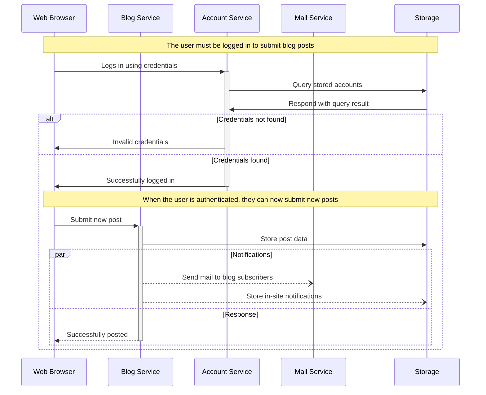

    


This platform offers users the ability to create an account, unlocking a myriad of features. Upon registration, users can either establish their own organization or explore existing ones housed in nearby establishments. The process is streamlined, complete with confirmation emails to ensure security.  they can craft a comprehensive CV file by seamlessly integrating in-house and external data. The platform facilitates communication through acceptance notifications or invitations, accessible both within the app and through email links.


Organization Middleware

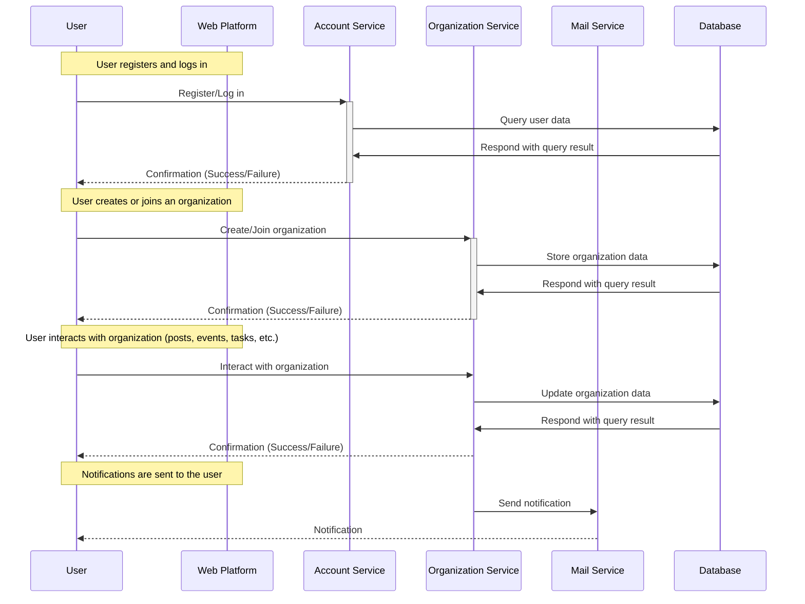


Once users are part of an organization, members gain access to a suite of tools, empowering them to create and view articles, peruse event timetables, request stewardship of prayers, contribute tickets, and even be assigned maintenance tasks. All these activities contribute to the development of a personal website for each member, enhancing their online presence.

For users operating in organization owner mode, they can navigate to their organization website, mirroring the organization's information onto a website users and organisations alike have the option to add custom domains, tailoring their online presence.

Administrators of mosques hold a distinct set of capabilities, enabling them to create events, manage prayer times, approve articles (this allows the article writers to gain a approved tick on their articles as their group agrees, oversee organization information, handle uploads (iframes) + tag members within those uploads hence them too gaining the upload on their personal site, and add buildings. The building addition process involves submission for approval, with data stored in a MongoDB database and spatially queried to enhance local organization searches.

A unique feature is the perspective incorporated into the mobile app, which extracts relevant data such as local buildings that would gender-specific perspectives. For instance, if there are four nearby buildings, the app could focus on the closest one, housing two organizations—one catering to males and the other to females.

The spatial query system further refines the user experience by displaying only the most pertinent local organizations at retreiving their data from the sql database. This dynamic approach enhances user engagement with a map and ensures that the platform remains user-centric but affordable.

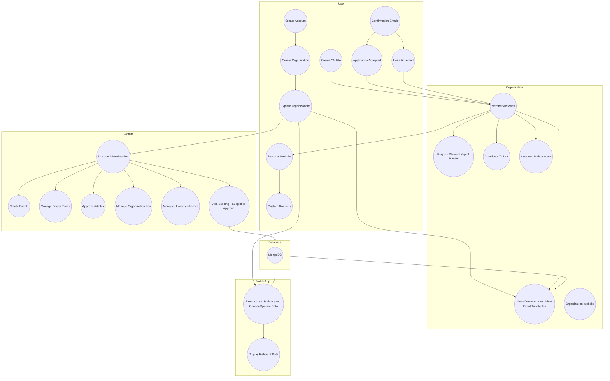


**User Activities:**
- Create/view articles
- Peruse event timetables
- Request stewardship of prayers
- Contribute tickets
- Be assigned maintenance tasks
- Develop personal accolade website

**Organization Owner Mode:**
- Navigate organization website
- Mirror organization information
- Add custom domains
- Add buildings (submission for approval) Spatially queried MongoDB for local organization searches

**Mosque Administrators:**
- Create events
- Manage prayer times
- Approve articles
- Oversee organization info
- Handle uploads (iframes)
- Tag members in uploads


**Unique Features:**
- Mobile app's gender-specific perspective
- Extracts relevant data (local buildings)
- Focus on closest building
- Displays most pertinent local organisations
- Affordable, list-based user engagement


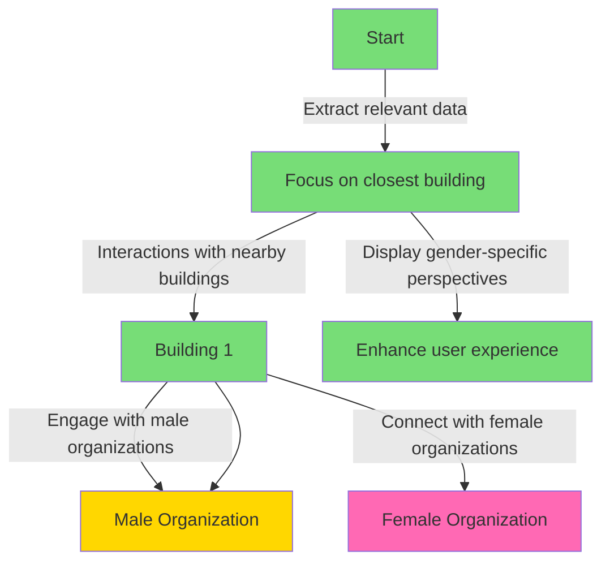


**Task** 

Imagine i am a mosque who wants to have a website for my organization 

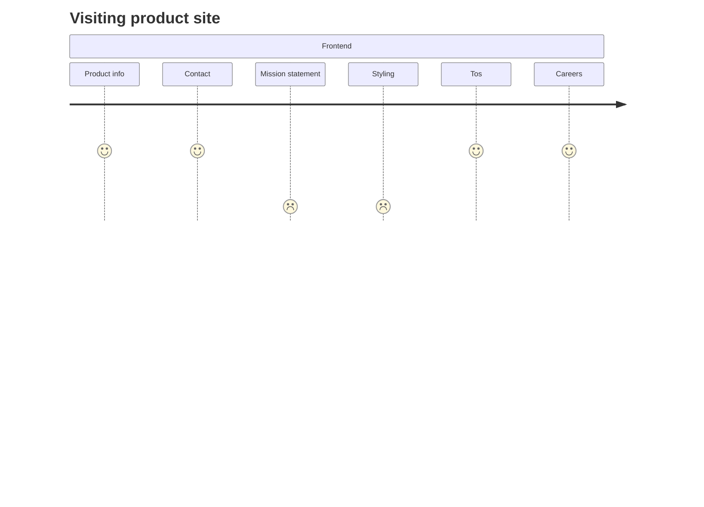


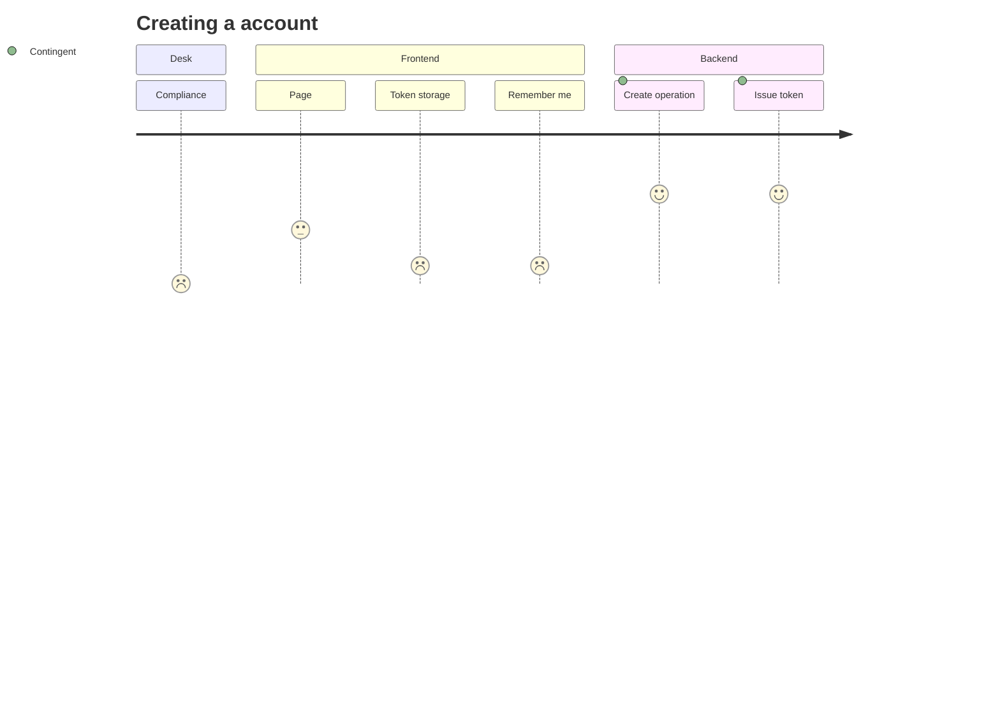


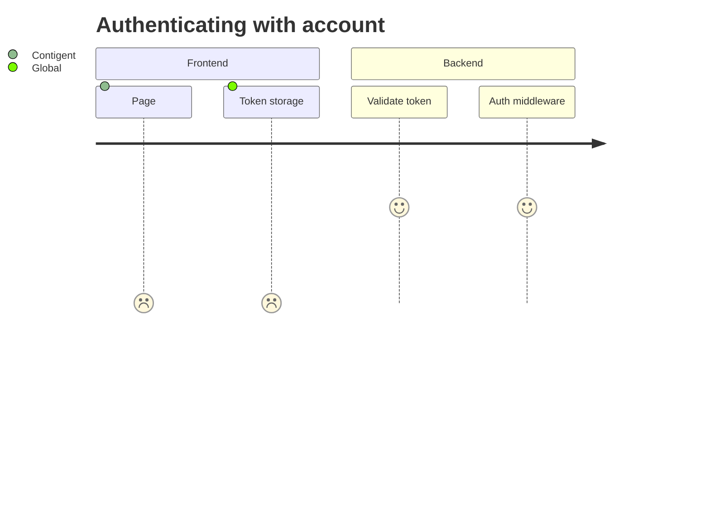


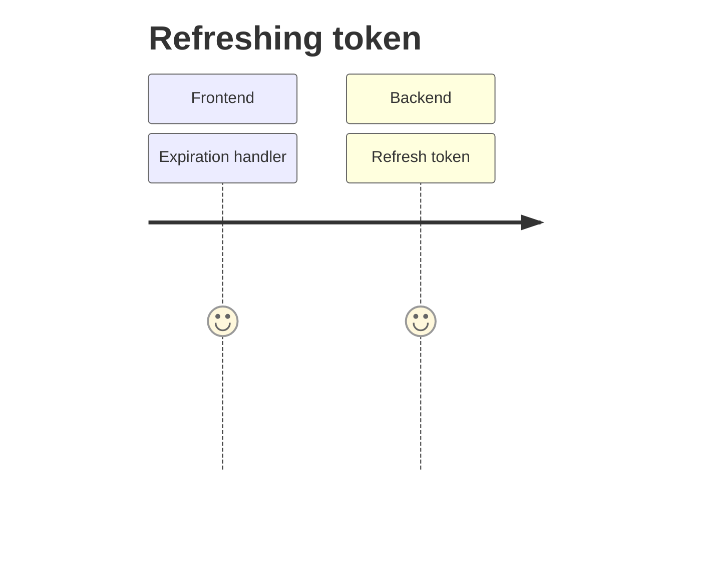


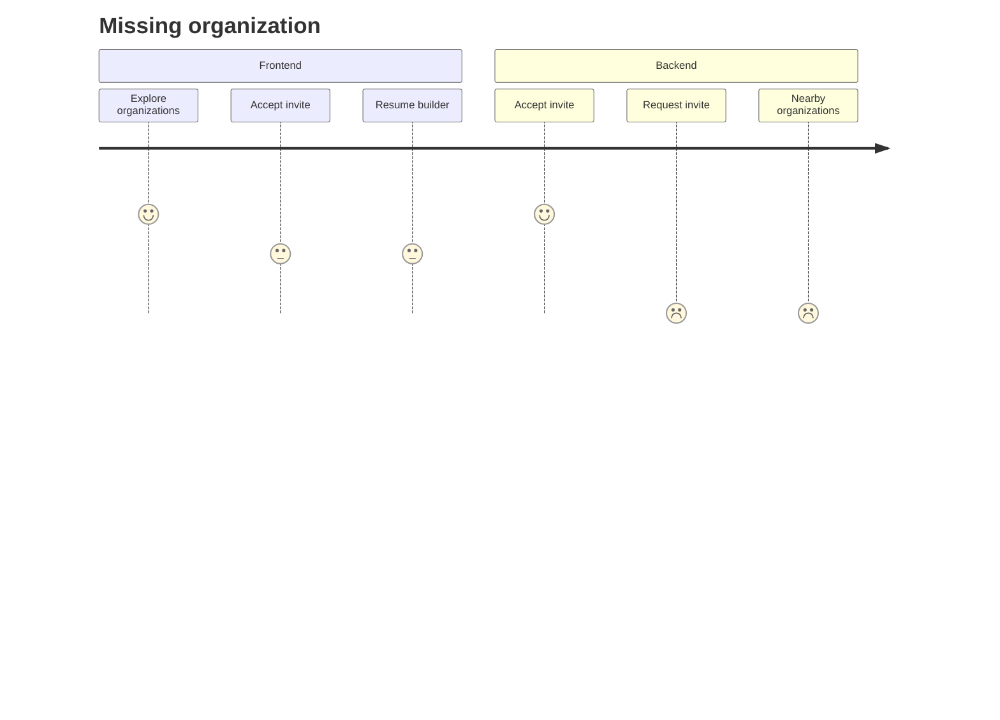


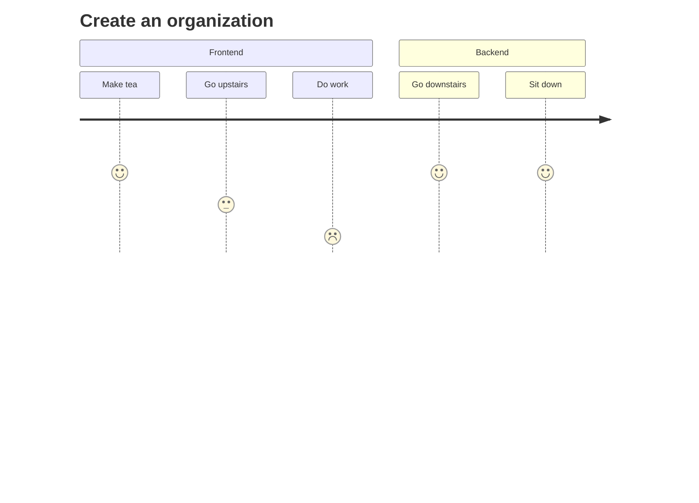
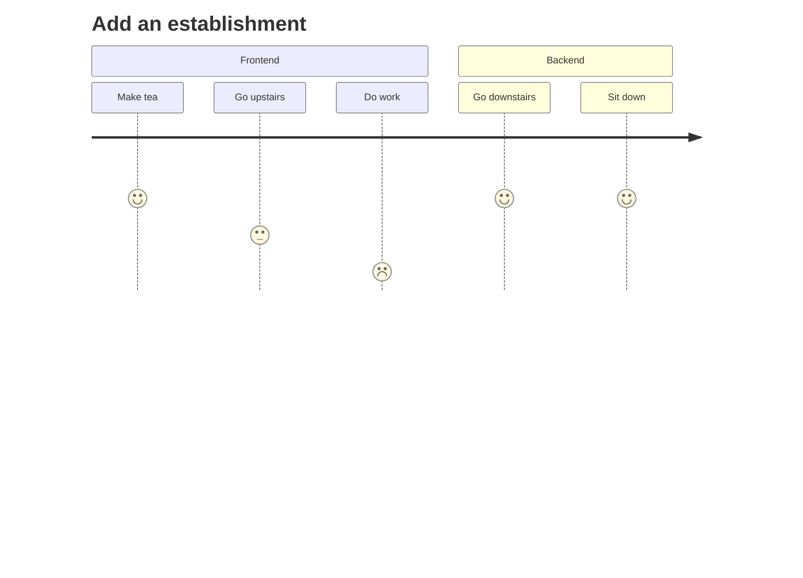
The process of a user applying for an establishment, submitting documents, and the verification procedure on the admin side:

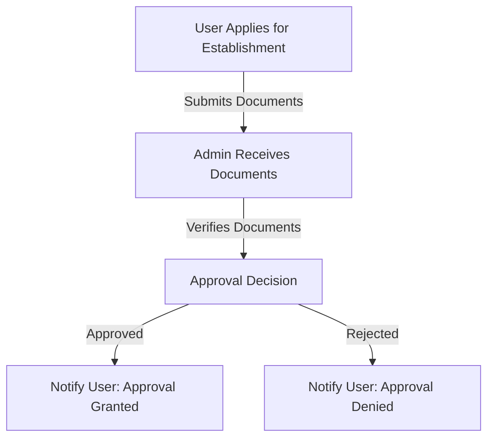


# Establishment Application and Verification Process

## Process Overview

1. **User Applies for Establishment:**
   - The user initiates the application process for establishing their entity.

2. **Admin Receives Documents:**
   - The user submits the required documents for verification.
   - The admin receives the documents on the administrative side.

3. **Verification Process:**
   - The admin verifies the submitted documents to ensure they meet the establishment's criteria and any legal requirements.
   - If additional information or corrections are needed, the admin communicates with the user.

4. **Approval Decision:**
   - Based on the verification results, the admin makes a decision regarding approval or rejection of the establishment application.

5. **Notification to User: Approval Granted:**
   - If the documents are approved, the user is notified, and the establishment is granted approval.

6. **Notification to User: Approval Denied:**
   - If the documents are rejected, the user is notified, and the establishment application is denied.

```
Note: This process could be automised heavily as company fraud does exist and is a valid problem companies face its not neccarily our responsibility to shake down our customers

Ps leading to that we can just sift documents for key data such as address ect and store 
```

Now their establishment is confirmed all organizations who claim affiliation can be approved under this entity and become now globally and locally searchable


## Manifesto 2 

Organizations have changed to establishments and also the repo has moved to the old repo and now its a migration to the other side 

EstablishmentID will just superceede Organizations 
and the newly created BuildingID will take on what was formerly known as "a establishment housing multiple organizations"

Website schema will have to change but thats part of the migration

Creating a organization / building formerly known as org and establishment

![[Pasted image 20231119123513.png]]

![[Pasted image 20231119222420.png]

