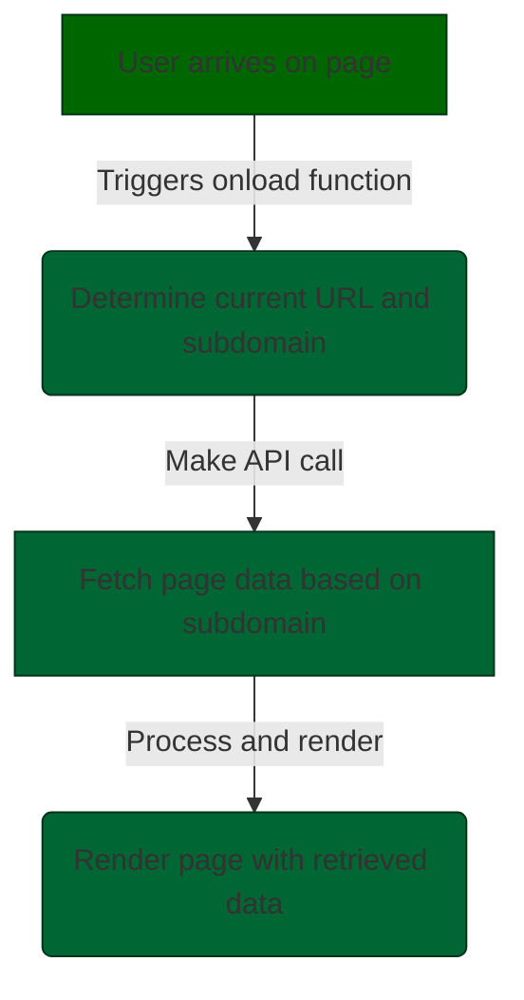
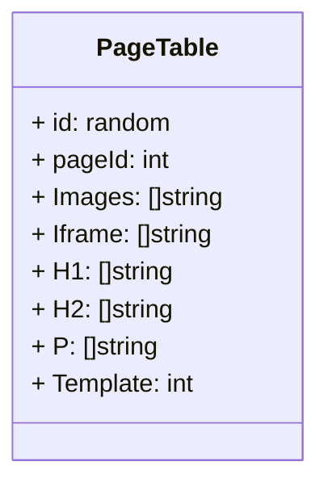
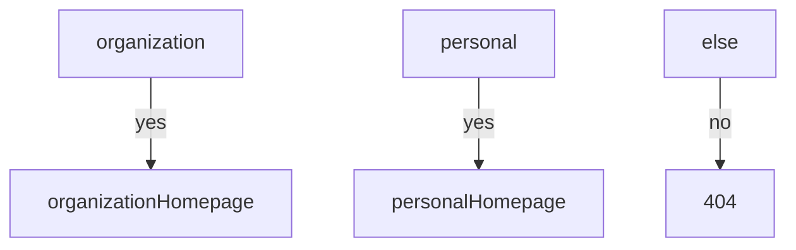
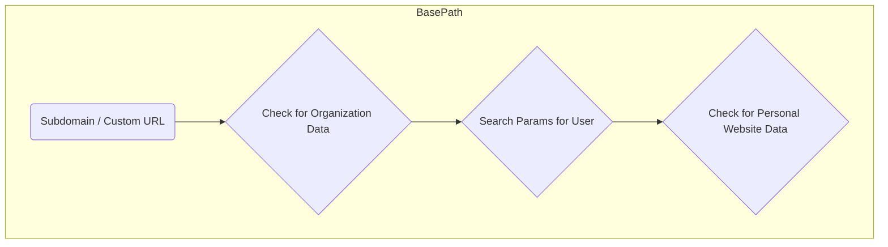

Pages will undergo processing by examining search parameters, subdomains, and custom URLs. Subsequently, API calls will be made to retrieve the specified data based on these criteria.

 Upon a user's page arrival, an `onload` function is activated. This function examines the current URL for a subdomain, searching for page data linked to the organization's username. The objective is to enhance page content uniqueness, prioritizing data over design improvements.

This management approach enables efficient and diverse saving of website data. Individual pages will be rendered conditionally based on the specified route, allowing for flexibility in presenting content as per the given conditions.

use cases 

**Home
# Organization 
- [x] backdrop photo
- [x] services overview
- [ ] donation 
- [ ] videos
- [ ] mission & objective
- [ ] mailing list
- [ ] 

