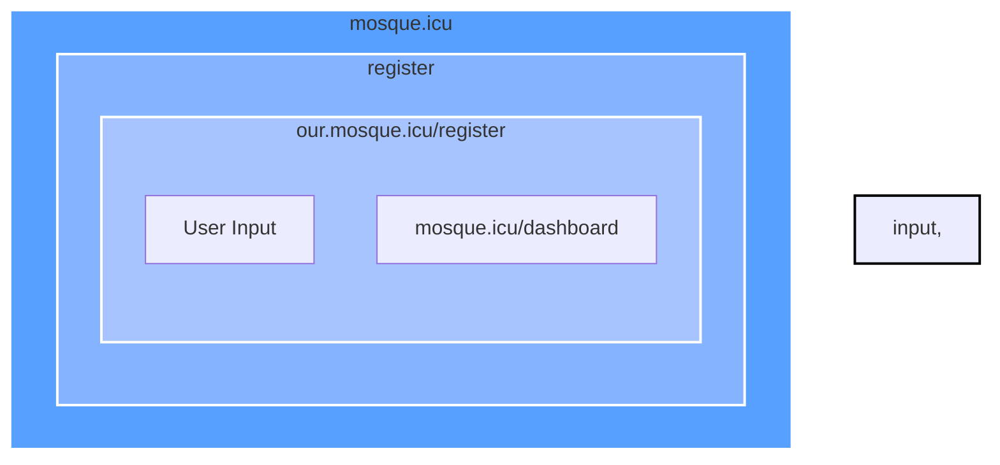
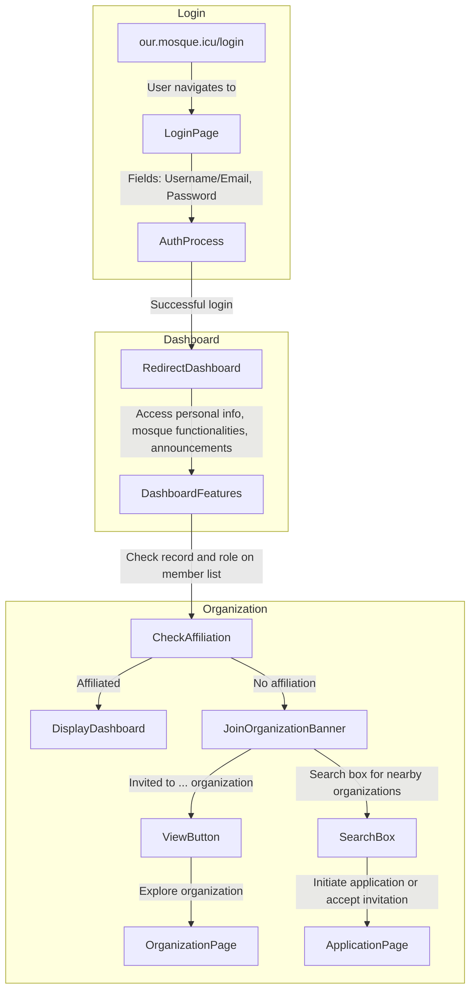
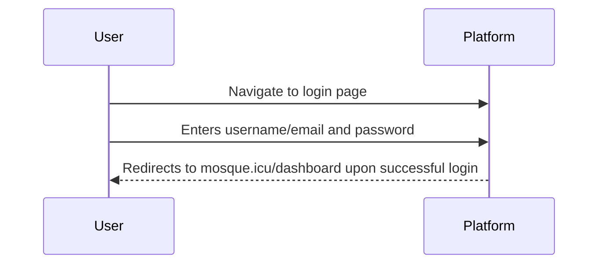
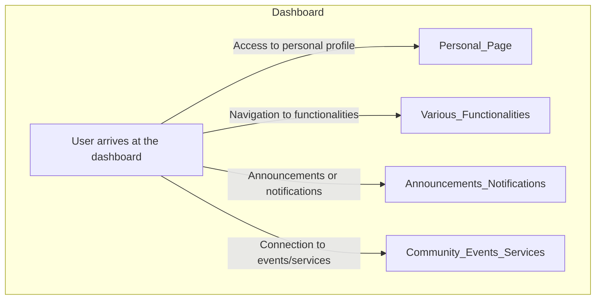

Title: Navigating the Spiritual Realm: A Seamless Registration Experience on Mosque.icu

```go

**mosque.icu - Register**

- **URL:** our.mosque.icu/register
  - **Description:** User is directed to the registration page.
- **Fields:**
  - Username
  - Email
  - Password
  - Additional details as needed
- **Actions:**
  - Upon successful registration, user is redirected to:
    - mosque.icu/dashboard
      - **Description:** User lands on the dashboard post-account creation.
- **Features:**
  - Access to personal profile information.
  - Navigation to various mosque-related functionalities.
  - Potential welcome message or onboarding guidance.
  - Connection to community events or services for an enriched user experience.
```

In the digital age, connecting with your faith community has never been more accessible. Mosque.icu, a platform dedicated to fostering connections within the Muslim community, offers a user-friendly and secure registration process that opens the door to a multitude of features and services.

### Registering on Mosque.icu

To embark on this spiritual journey, users start by visiting the registration page at [our.mosque.icu/register](our.mosque.icu/register). This seamlessly designed page collects essential information to create a personalized account:

- **Username:** Users can choose a unique identifier.
- **Email:** A valid email address ensures communication and updates.
- **Password:** Ensuring account security with a personalized password.
- **Additional Details:** Tailored to gather relevant information for a personalized experience.

### The Registration Journey

Once users have provided the necessary details, the platform processes the information, ensuring the accuracy and completeness of the registration. Upon successful completion, users are redirected to their spiritual hub at [mosque.icu/dashboard](mosque.icu/dashboard).

### Welcome to the Dashboard

The dashboard is not just a landing page; it's a gateway to a world of spiritual connectivity and community engagement. Here's what users can expect:

- **Personal Profile Access:** Users can review and update their personal information, fostering a sense of ownership and identity within the community.

- **Navigation to Mosque Functionalities:** The dashboard serves as a central hub for various mosque-related functionalities. From prayer timings to community announcements, everything is just a click away.

- **Onboarding Guidance:** New users may receive a warm welcome message or onboarding guidance, ensuring they feel connected and supported from the moment they step into the digital mosque.

- **Community Events and Services:** Stay informed about upcoming events, services, and community gatherings. The dashboard serves as a bridge, connecting users to the pulse of the community.

### Conclusion

Mosque.icu's registration process isn't just about creating an account; it's about laying the foundation for a rich and fulfilling spiritual experience. From the initial steps of registration to the welcoming dashboard, the platform seamlessly integrates technology with spirituality, fostering a sense of community and belonging for users on their digital pilgrimage. Join Mosque.icu today and embark on a journey where technology and faith converge harmoniously.


Title: Enhancing Community Engagement Through Mosque.icu's User-Friendly Portal

In the digital age, staying connected with our religious community is vital, and Mosque.icu's user-friendly portal offers a seamless experience for users. Let's delve into the key features of the login process and the dashboard, highlighting how this platform fosters community engagement.

**Login Experience:**

Navigating to our.mosque.icu/login sets the stage for a straightforward login process. Users are prompted to enter their username/email and password, ensuring a secure entry to the platform.

**Dashboard Overview:**

Upon successful login, users are greeted with the dynamic mosque.icu/dashboard. This hub serves as a centralized space, enhancing the overall user experience. 

**Access to Personal Profile:**

Users gain direct access to their personal profile information. This feature allows individuals to update and manage their details, fostering a sense of ownership and connection with the platform.

**Mosque-Related Functionalities:**

The dashboard serves as a gateway to various mosque-related functionalities. From prayer schedules to event registrations, users can seamlessly navigate and engage with the diverse offerings tailored to their religious needs.

**Announcements and Notifications:**

Stay informed and connected with the latest happenings through relevant announcements and notifications. Whether it's a community event or an important update, users can rely on mosque.icu to keep them in the loop.

**Community Events and Services:**

The platform facilitates a seamless connection to community events and services. Users can effortlessly explore and participate in events, strengthening their ties with the broader religious community.

In conclusion, Mosque.icu's user-friendly portal goes beyond a simple login page; it serves as a digital bridge, connecting individuals with their religious community in meaningful ways. With features designed to enhance engagement and communication, this platform stands as a testament to the intersection of technology and spirituality, fostering a sense of unity and belonging in the digital age.

```go
**mosque.icu - Login**

- **URL:** our.mosque.icu/login
  - **Description:** User navigates to the login page.
- **Fields:**
  - Username/Email
  - Password
- **Actions:**
  - Upon successful login, user is redirected to:
    - mosque.icu/dashboard
      - **Description:** User arrives at the dashboard.
- **Features:**
  - Access to personal profile information.
  - Navigation to various mosque-related functionalities.
  - Relevant announcements or notifications.
  - Seamless connection to community events or services.

```




![[Pasted image 20231116104902.png]]

When a user successfully logs in to mosque.icu via our.mosque.icu/login, the system initiates a comprehensive authentication process. This involves cross-referencing the user's credentials with the member list to determine their specific role and organizational affiliation.

If the system identifies an existing affiliation, the user is seamlessly directed to mosque.icu/dashboard. Here, they gain access to a spectrum of features, including their personal profile information, diverse mosque-related functionalities, and a hub for pertinent announcements or notifications.

However, in instances where no organizational affiliation is found, the user encounters a tailored experience. The dashboard dynamically generates a prominent banner, notifying the user of invitations to join a specific organization. This banner not only communicates the invitation but also provides a "View" button for immediate exploration.

![[Pasted image 20231116105127.png]]


To enhance user engagement, a search box is incorporated into the dashboard, facilitating the discovery of nearby organizations. Users can delve into potential affiliations by initiating the application process on the subsequent page. Alternatively, for those who have received invitations, the dashboard seamlessly integrates an option to accept these invitations, ensuring a user-friendly and intuitive experience. whist promping and generating information for their application and creating a cv file similar to an experience on linked in 


<iframe height="400" width="800" src='https://spotlight.tailwindui.com'/>
users and organizations in the public routes will have access tot heir own wesites with set 




Title: **Empowering Connectivity: Exploring the Dynamic Features of Mosque.icu**

In the realm of online community platforms, Mosque.icu stands out as a versatile and user-centric space that not only fosters connectivity but also provides a personalized touch to its users. Navigating through its intricacies, let's delve into the various features that make this platform a unique hub for individuals and organizations alike.

### **Login Experience:**

Upon entering the platform at [our.mosque.icu/login](our.mosque.icu/login), users encounter a straightforward login page. The login process involves entering a username or email along with a password. Once successfully authenticated, users are seamlessly redirected to their personalized dashboard at [mosque.icu/dashboard](mosque.icu/dashboard).

### **Dashboard Dynamics:**

The dashboard serves as the central hub for users, offering access to personal profile information and a gateway to various mosque-related functionalities. It acts as a command center, allowing individuals and organizations to efficiently manage their activities within the platform.

### **Reserved Page Paths:**

One notable feature is the structured base path that hosts reserved page paths. These paths mimic a customer's website and can be customized to some extent. Essential pages like "about," "contact," etc., are predefined, ensuring a consistent and user-friendly experience. Notably, two variants exist: personal and organizational.

### **Personal and Organizational Pages:**

Users can carve out their unique online presence through personalized URLs. These URLs showcase individual or organizational information, works, and contributions such as articles. Both personal and organizational pages share common functionalities, such as displaying the latest articles, but they maintain distinct styles to highlight the unique essence of users and organizations.

### **Tailored Styles for Uniqueness:**

The platform goes the extra mile in personalization by allowing users and organizations to distinguish themselves through distinct styles. Whether it's the layout, color scheme, or overall design, each page exudes an identity that reflects the essence of the user or organization it represents.

### **Administrative Power with Dashboard Routes:**

While personal and organizational pages cater to the expressive and connective aspects, dashboard routes are reserved for administrative tasks. This section empowers users with the tools needed to manage and oversee various aspects of their involvement on Mosque.icu, adding a layer of control and efficiency to the overall experience.

In conclusion, Mosque.icu transcends the conventional boundaries of online community platforms by offering a rich and personalized experience for its users. The amalgamation of reserved page paths, personal and organizational pages, and an administrative dashboard provides a comprehensive ecosystem where individuals and organizations can thrive, connect, and contribute to the vibrant community that is Mosque.icu.




![[Pasted image 20231116112448.png]]

users only get a profile page like such with their credentials and articles projects speaking and uses all tbc but in concept and most links will link back to a mosque icu service such as articles, recitations ect 


![[Pasted image 20231116112733.png]]

Image, logo. slogan, fundraising, display, timetable ( should produce ics also ) , contact , media 

Prayer times iframe![[Screenshot 2023-11-16 at 11.53.40.png]]


services

<iframe width='800' height='600' src='https://spotlight.tailwindui.com/projects' />
personal - home , atricles , projects, speaking, uses
ogranization - home (avatar) , articles, projects , speaking, fundraiser, timetable, contact 

the organiation id on user creation needs to be a string so that when we query it and also on user account creeation they can have a wildcard domain easily  as this natrually has the requirement to be a string and unique and can be a organizaion id 

personal profiles always will be search parameters and at.mosque.icu

![[Screenshot 2023-11-16 at 12.23.36.png]]

at.mosque.icu will now need to be another sales website geared around the service 

- mosque.icu will need to be more encapsulating even of the community ect
(very blue ect)

user 

all about the app 

- community 
coop (calibur local events)
discord (1)

business 

all about being seen on the app +  free admin products goes to at.mosque.icu where you read more and theres another login button option there too 

discord (2)

<iframe src='https://www.toogoodtogo.com/en-gb' width='800' height='600' />
![[Screenshot 2023-11-16 at 12.36.47.png]]Where we introduce our free suite of products ![[Screenshot 2023-11-16 at 12.37.14.png]]
![[Screenshot 2023-11-16 at 12.37.48.png]]image of someone praying something profound 