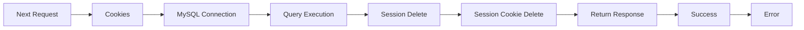

```ts

import { cookies } from "next/headers";
import { NextResponse } from "next/server";
import mysql from "mysql2/promise";

//@ts-expect-error
const conn = mysql.createConnection(process.env.DATABASE_URL);

export const POST = async (req: Request, res: Response) => {
  try {
    const sessionCookie = cookies().get("session");

    if (!sessionCookie) return NextResponse.json({ message: "unauthorised", errors: true }, { status: 401 });

    //Delete session from db
    await (await conn).execute("DELETE FROM SessionStorage WHERE token = ?", [sessionCookie.value]);

    //Delete session cookie
    cookies().set("session", "", {
      path: "/",
      maxAge: 0,
      sameSite: "lax",
      secure: process.env.NODE_ENV === "production",
    });

    return NextResponse.json({ success: true });
  } catch (err) {
    console.log(err);
    return NextResponse.json({ message: "There was an error", errors: true }, { status: 500 });
  }
};


```


In this overview, the graph represents the flow of the code in the Go file. The nodes in the graph represent the different components of the code, and the arrows represent the data flow between them.

* Node A represents the `Next Request` component, which is the entry point of the code.
* Node B represents the `Cookies` component, which retrieves the session cookie from the request.
* Node C represents the `MySQL Connection` component, which creates a connection to the MySQL database using the `mysql2/promise` library.
* Node D represents the `Query Execution` component, which executes a DELETE query on the database to delete the session.
* Node

```
