```ts

import { NextResponse } from "next/server";
import { uuid } from "uuidv4";
import { CheckErrors } from "@/app/_helpers/api/helpers";
import mysql from "mysql2/promise";

const argon2 = require("argon2");

// create the connection to database #
//@ts-expect-error
const connection = mysql.createConnection(process.env.DATABASE_URL);

export const POST = async (req: Request, res: Response) => {
  try {
    const body = await req.json();

    const errors = await CheckErrors(body, {
      email: "required|email|max:255",
      password: "required|type:string|min:8|max:100",
      firstName: "required|min:2|max:50",
      lastName: "required|min:2|max:50",
    });
    if (errors) return NextResponse.json({ message: errors, errors: true }, { status: 400 });

    body.hashedPassword = await argon2.hash(body.password);

    const [rows, fields] = await (
      await connection
    ).execute("INSERT INTO User (privateId, email, hashedPassword, firstName, lastName, salt) VALUES (?, ?, ?, ?, ?, ?)", [
      uuid(),
      body.email,
      body.hashedPassword,
      body.firstName,
      body.lastName,
      uuid(),
    ]);

    return NextResponse.json({ success: true, rows: rows, field: fields });
  } catch (e: any) {
    console.log(e);
    //check if the error is a unique constraint error myysql
    if (e.code === "ER_DUP_ENTRY") {
      return NextResponse.json({ message: "Email is already taken", errors: true }, { status: 400 });
    }

    return NextResponse.json({ message: "Server error", errors: true }, { status: 500 });
  }
};


```

```mermaid
graph LR
    A[NextResponse] --> B[req]
    B --> C[res]
    A --> D[body]
    D --> E[errors]
    E --> F[connection]
    F --> G[rows]
    G --> H[fields]
    H --> I[salt]
    I --> J[uuid]
    J --> K[body.email]
    K --> L[body.hashedPassword]
    L --> M[body.firstName]
    M --> N[body.lastName]
    N --> O[e]
    O --> P[console.log]
    P --> Q[e.code]
    Q --> R[ER_DUP_ENTRY]
    R --> S[NextResponse.json]
    S --> T[message]
    T --> U[errors]
    U --> V[status]
    V --> W[500]
    W --> X[unique constraint error]
    X --> Y[MySQL error]

```


