```ts

import { NextResponse } from "next/server";

import mysql from "mysql2/promise";

//@ts-expect-error
const conn = mysql.createConnection(process.env.DATABASE_URL);

export async function GET(request: Request) {
  const { searchParams } = new URL(request.url);
  const cronKey = searchParams.get(process.env.CRON_KEY);
  if (!cronKey) {
    return NextResponse.json({ message: "Error doing request", errors: true }, { status: 500 });
  }

  //Delete all sessions which are 1 week old

  let date7DaysAgo = new Date();
  date7DaysAgo.setDate(date7DaysAgo.getDate() - 7);

  await (await conn).query("DELETE FROM SessionStorage WHERE createdAt < ?", [date7DaysAgo]);

  return NextResponse.json({ success: true });
}


```


```mermaid
graph LR
    A[NextResponse] --> B[GET request]
    B --> C[searchParams]
    C --> D[cronKey]
    D --> E[conn]
    E --> F[query]
    F --> G[DELETE]
    G --> H[SessionStorage]
    H --> I[createdAt]
    I --> J[date7DaysAgo]
    J --> K[query]
    K --> L[return]
    L --> M[success]
```

Explanation:

* A is the starting point of the graph, representing the `NextResponse` object.
* B represents the `GET` request, which is the entry point of the function.
* C is the `searchParams` object, which contains the `CRON_KEY` parameter.
* D is the `conn` object, which is created using the `mysql2/promise` library.
* E is the `query` function, which is called with the `conn` object and the `date7DaysA

```
