```ts

import { getSession } from "@/app/_helpers/api/helpers";
import {
  addServerCacheValue,
  deleteFromServerCache,
  getServerCacheValue,
} from "@/app/_helpers/api/servercache";
import { NextRequest, NextResponse } from "next/server";
import mysql from "mysql2/promise";

//@ts-expect-error
const conn = mysql.createConnection(process.env.DATABASE_URL);

//Get current prayer
export const GET = async (req: NextRequest, res: Response) => {
  try {
    const session = await getSession(conn);
    if (!session?.establishmentId)
      return NextResponse.redirect("/login?unauthorised=true");

    const id = req.nextUrl.searchParams.get("id");

    const cachedData = await getServerCacheValue("prayer" + id);
    if (cachedData) return NextResponse.json(cachedData);

    const [prayer] = (await (
      await conn
    ).query(
      "SELECT id, title, description, timesData, userId, createdAt, updatedAt, deletedAt, FROM Prayer WHERE id = ?",
      [id]
    )) as any;

    addServerCacheValue(prayer, "prayer" + id);

    return NextResponse.json(prayer[0]);
  } catch (err) {
    console.log(err);
    return NextResponse.json(
      { message: "There was an error", errors: true },
      { status: 500 }
    );
  }
};


```


```mermaid

graph LR
    A[Get current prayer] --> B[Get session]
    B --> C[Get server cache value]
    C --> D[Add server cache value]
    D --> E[Return cached data]
    E --> F[Query database]
    F --> G[Return prayer data]
    G --> H[Add prayer data to server cache]
    H --> I[Return prayer data]
    I --> J[Return error message]
    J --> K[Return error status]
```

This overview shows the relationships between the different functions and variables in the Go file. The graph represents the flow of data and control through the program.

Here are some key elements of the overview:

* `A`: The top-level function that handles the request.
* `B`: The function that gets the current session.
* `C`: The function that adds a server cache value.
* `D`: The function that retrieves the cached data.
* `E`: The function that queries the database.
* `F`: The function

```
