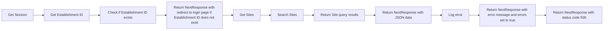

```ts

import { getSession } from "@/app/_helpers/api/helpers";
import { NextResponse } from "next/server";
import mysql from "mysql2/promise";

//@ts-expect-error
const conn = mysql.createConnection(process.env.DATABASE_URL);

export const POST = async (req: Request, res: Response) => {
  try {
    const session = await getSession(conn);
    if (!session?.establishmentId) return NextResponse.redirect("/login?unauthorised=true");

    const body = await req.json();

    //Search sites
    // const SiteQuery = await sql`SELECT "id", "description", "label", "permissions", "adminIds", "userId", "thumbnail", "createdAt", "updatedAt" FROM "Site"
    //         WHERE "establishmentId" = ${session.establishmentId}  AND ILIKE "label" ${body.searchTerm} ORDER BY "id" DESC LIMIT 30`;

    const [SiteQuery] = await (
      await conn
    ).query(
      "SELECT id, description, label, permissions, adminIds, userId, thumbnail, createdAt, updatedAt FROM Site WHERE establishmentId = ? AND label LIKE ? ORDER BY id DESC LIMIT 30",
      [session.establishmentId, "%" + body.searchTerm + "%"]
    );

    return NextResponse.json({ success: true, data: SiteQuery.rows });
  } catch (err) {
    console.log(err);
    return NextResponse.json({ message: "There was an error", errors: true }, { status: 500 });
  }
};


```


In this overview, the graph represents the flow of the code in the Go file. The nodes in the graph are labeled with the names of the functions or operations being performed, and the edges represent the flow of control between them.
Here's a brief explanation of each node and edge in the graph:
* `A[Get Session]`: This is the entry point of the code,

```
