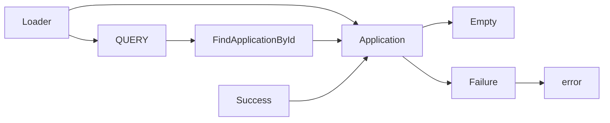

```js

import Loader from 'src/components/Loader/Loader'
import Application from 'src/components/Application/Application'

export const QUERY = gql`
  query FindApplicationById($id: String!) {
    application: application(id: $id) {
      id
      type
      userId
    }
  }
`

export const Loading = () => <Loader />

export const Empty = () => <div>Application not found</div>

export const Failure = ({ error }) => (
  <div className="rw-cell-error">{error?.message}</div>
)

export const Success = ({ application }) => {
  return <Application application={application} />
}


```


Explanation:

* `Loader`: A component that displays a loading animation.
* `Application`: A component that renders the application data.
* `Query`: A GraphQL query that retrieves an application by its ID.
* `FindApplicationById`: A resolver function that retrieves an application by its ID.
* `Empty`: A component that displays a message when the application is not found.
* `Failure`: A component that displays an error message when the query fails.
* `Success`: A component that renders the application data when the query succeeds

```
